# AI RESUME ANALYZER

<div align="center">
  <h1>🌴 AI RESUME ANALYZER 🌴</h1>
  <p>A Tool for Resume Analysis, Predictions and Recommendations</p>
</div>

<br/>

## About the Project 🥱
<div align="center">
    <br/>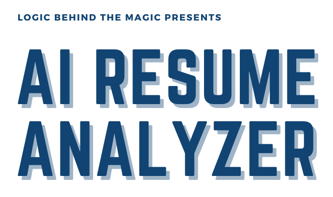<br/><br/>
    <p align="justify"> 
      A tool which parses information from a resume using natural language processing and finds the keywords, cluster them onto sectors based on their keywords. 
      And lastly show recommendations, predictions, analytics to the applicant / recruiter based on keyword matching.
    </p>
</div>

## Scope 😲
i. It can be used for getting all the resume data into a structured tabular format and csv as well, so that the organization can use those data for analytics purposes

ii. By providing recommendations, predictions and overall score user can improve their resume and can keep on testing it on our tool

iii. And it can increase more traffic to our tool because of user section

iv. It can be used by colleges to get insight of students and their resume before placements

v. Also, to get analytics for roles which users are mostly looking for

vi. To improve this tool by getting feedbacks

<!-- TechStack -->
## Tech Stack 🍻
<details>
  <summary>Frontend</summary>
  <ul>
    <li>Streamlit</li>
    <li>HTML</li>
    <li>CSS</li>
    <li>JavaScript</li>
  </ul>
</details>

<details>
  <summary>Backend</summary>
  <ul>
    <li>Streamlit</li>
    <li>Python</li>
  </ul>
</details>

<details>
<summary>Database</summary>
  <ul>
    <li>MySQL</li>
  </ul>
</details>

<details>
<summary>Modules</summary>
  <ul>
    <li>pandas</li>
    <li>pyresparser</li>
    <li>pdfminer3</li>
    <li>Plotly</li>
    <li>NLTK</li>
  </ul>
</details>

<!-- Features -->
## Features 🤦‍♂️
### Client: -
- Fetching Location and Miscellaneous Data

  Using Parsing Techniques to fetch
- Basic Info
- Skills
- Keywords

Using logical programs, it will recommend
- Skills that can be added
- Predicted job role
- Course and certificates
- Resume tips and ideas
- Overall Score
- Interview & Resume tip videos

### Admin: -
- Get all applicant’s data into tabular format
- Download user’s data into csv file
- View all saved uploaded pdf in Uploaded Resume folder
- Get user feedback and ratings
  
  Pie Charts for: -
- Ratings
- Predicted field / roles
- Experience level
- Resume score
- User count
- City
- State
- Country

### Feedback: -
- Form filling
- Rating from 1 – 5
- Show overall ratings pie chart
- Past user comments history 

## Requirements 😅
### Have these things installed to make your process smooth 
1) Python (3.9.12)
2) SQLite
3) Visual Studio Code **(Prefered Code Editor)**
4) Visual Studio build tools for C++

## Setup & Installation 👀

To run this project, perform the following tasks:

Create a virtual environment and activate it **(recommended)**

Open your command prompt and change your project directory to ```AI-Resume-Analyzer``` and run the following command 
```bash
python -m venv venvapp

cd venvapp/Scripts

activate

```

Downloading packages from ```requirements.txt``` inside ``App`` folder
```bash
cd../..

cd App

pip install -r requirements.txt

python -m spacy download en_core_web_sm

```

After installation is finished create a Database ```cv```

And change user credentials inside ```App.py``` (check line around 95)

Go to ```venvapp\Lib\site-packages\pyresparser``` folder
And replace the ```resume_parser.py``` with the provided `resume_parser.py` file.

``Congratulations 🥳😱 your set-up 👆 and installation is finished 😵🤯``

I hope that your ``venvapp`` is activated and working directory is inside ``App``

Run the ```App.py``` file using
```bash
streamlit run App.py

```

## Known Error 🤪
If ``GeocoderUnavailable`` error comes up then just check your internet connection and network speed

## Usage
- After the setup it will do stuff's automatically
- You just need to upload a resume and see it's magic
- Try first with the sample resume uploaded in ``Uploaded_Resumes`` folder
- Admin userid is ``admin`` and password is ``admin@resume-analyzer``

<!-- Roadmap -->
## Roadmap 🛵
* [x] Predict user experience level.
* [x] Add resume scoring criteria for skills and projects.
* [x] Added fields and recommendations for web, android, ios, data science.
* [ ] Add more fields for other roles, and its recommendations respectively. 
* [x] Fetch more details from users resume.
* [ ] View individual user details.

## Preview 👽

### Client Side

**Main Screen**


**Resume Analysis**


**Skill Recommendation**

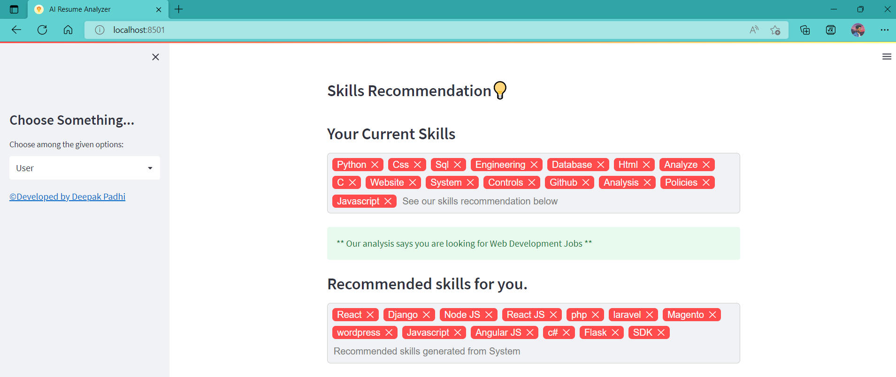

**Course Recommendation**

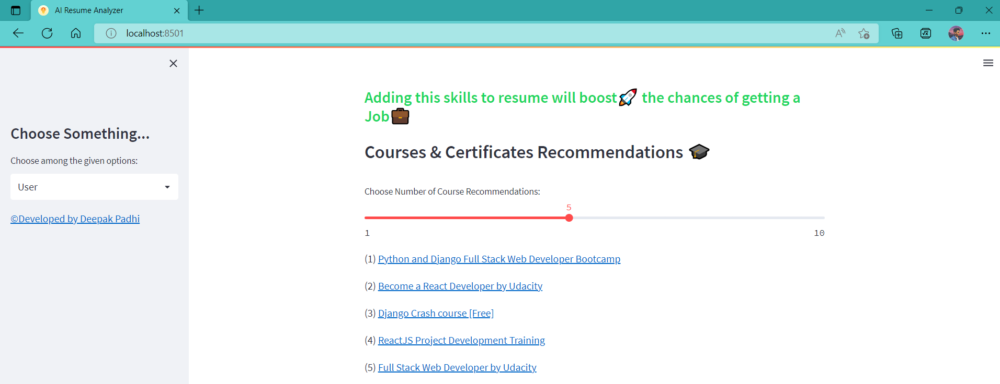

**Tips and Overall Score**


**Video Recommendation**

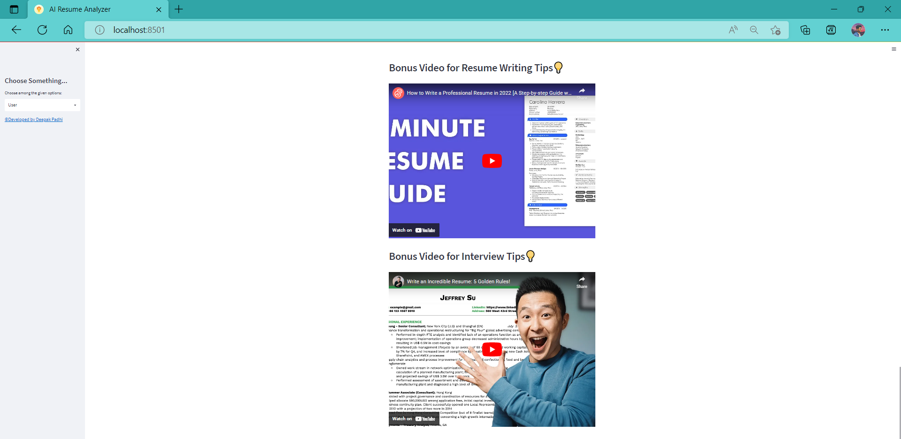

### Feedback

**Feedback Form**


**Overall Rating Analysis and Comment History**

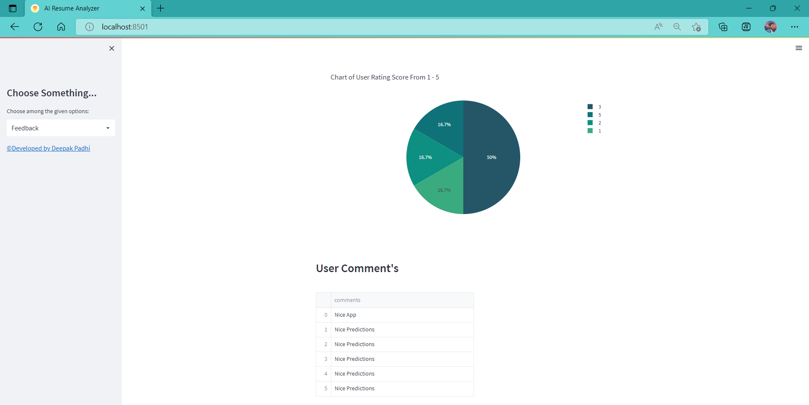

### Admin

**Login**


**User Count and it's data**

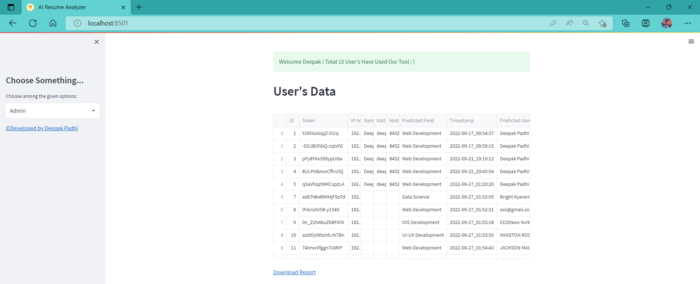

**Exported csv file**

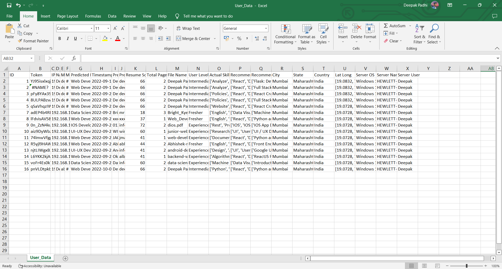

**Feedback Data**

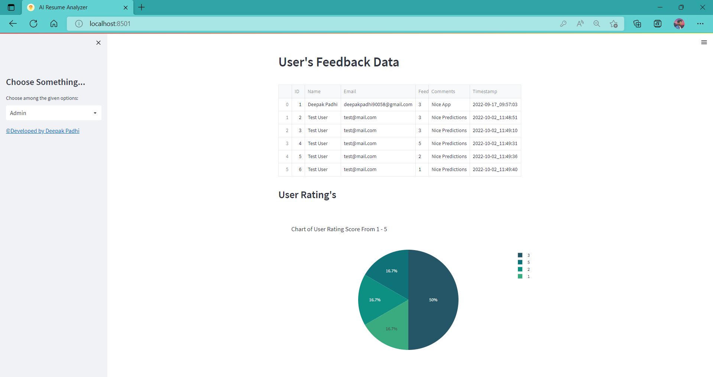

**Pie Chart Analytical Representation of clusters**

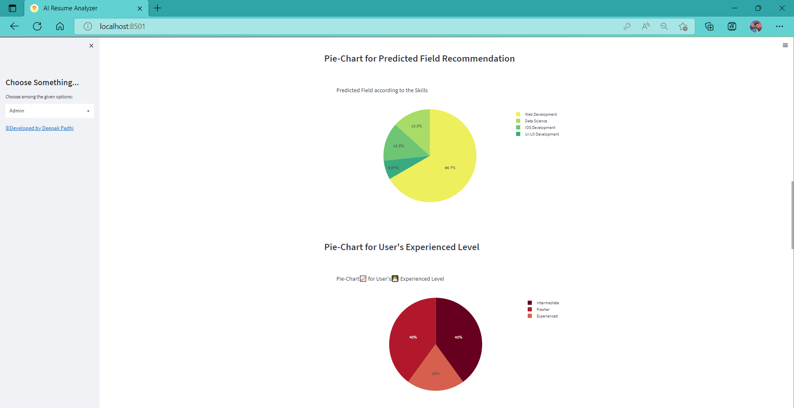

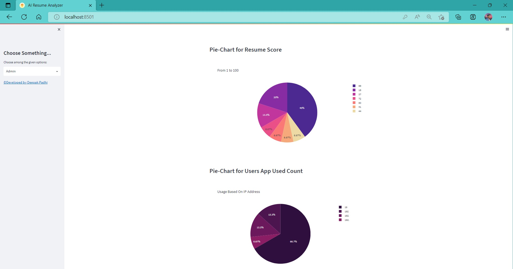

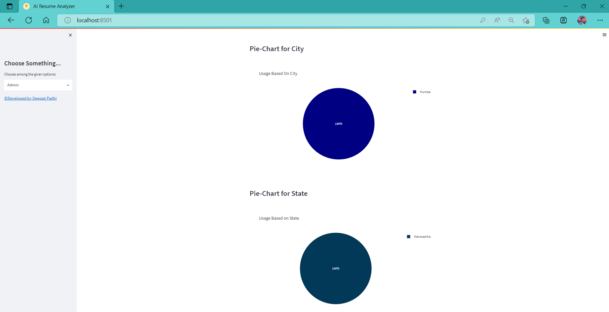